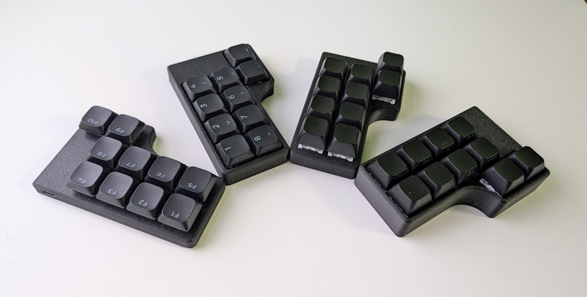

# PNCATEHO

Handwired fork PNCATEHO by aroum [https://github.com/aroum/PNCATEHO]



## Case

Thingiverse: https://www.thingiverse.com/thing:7178890

## QMK

* copy directory pncateho to qmk/keyboards/alko/pncateho
* run ```qmk compile -kb alko/pncateho -km default```
* flash file alko_pncateho_default.uf2 to your rp2040

## Vial

* copy directory pncateho to qmk-vial/keyboards/alko/pncateho
* run ```qmk compile -kb alko/pncateho -km vial```
* flash file alko_pncateho_vial.uf2 to your rp2040
* run vial app (or open https://vial.rocks) and load pncateho.vil

